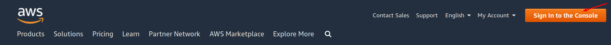
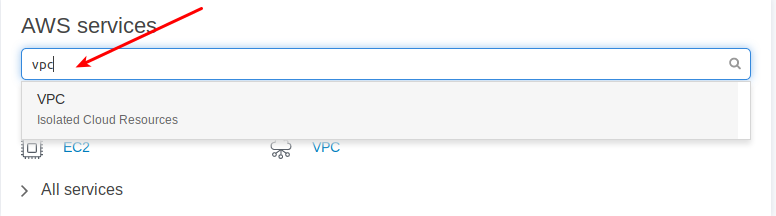
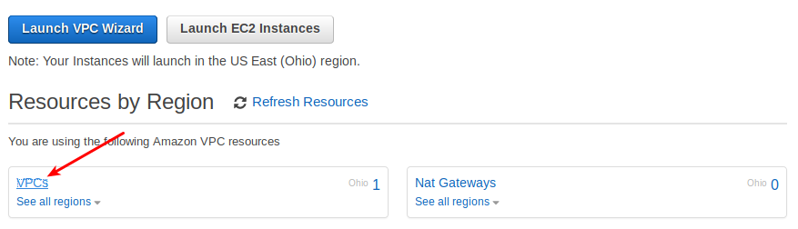
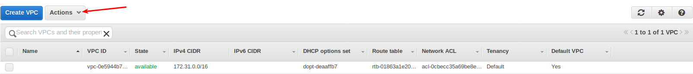
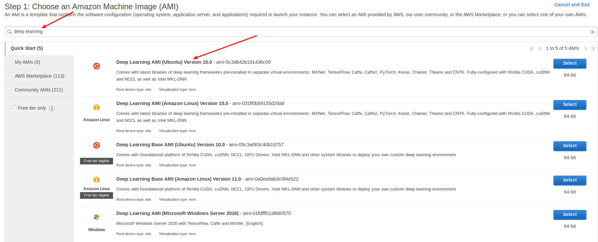
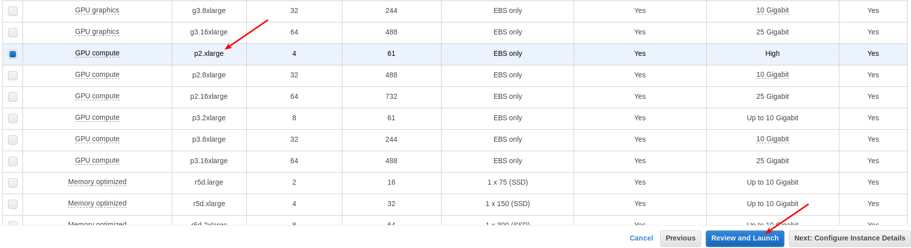
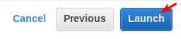
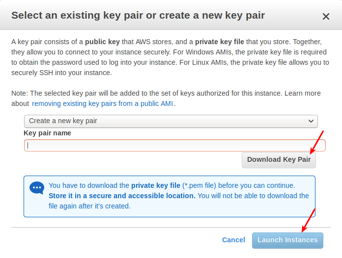
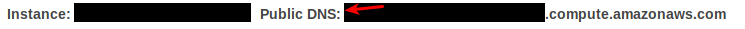
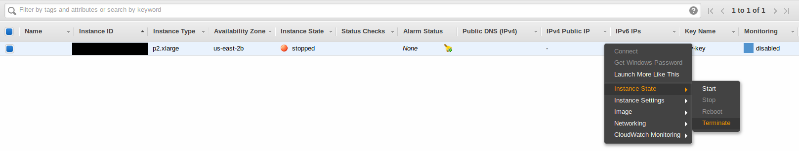

---

title: DLAMI
keywords: 
sidebar: home_sidebar

---
# Welcome to DLAMI!

[DLAMI](https://aws.amazon.com/machine-learning/amis/) is basically a virtual machine hosted by Amazon and specially dedicated to Deep Learning tasks. As such, it has convenient features with pre-installed popular deep learning frameworks including Pytorch, Tensorflow and Keras and the necessary CUDA and NVIDIA drivers to accelerate your training.

# Setting up the DLAMI

Setting up a DLAMI can be daunting but don't worry, we got you covered. In fact, Amazon has a sweet [step by step guide](https://aws.amazon.com/getting-started/tutorials/get-started-dlami/) to set it up and we are going to draw heavily from their tutorial.

## Step 1: Sign in or sign up

Visit the [AWS webpage](https://aws.amazon.com/) and click on 'Sign In to the Console'.

If you do not have an account, the button to press will say 'Sign up' instead of 'Sign in to the Console'.

Next, enter your credentials if you are signing in or e-mail, account name and password if you need to sign up. If you are signing up you will also need to set your credit card details. This will be the credit card to which all the charges of the instance usage will be applied (if you have free credits you will not be charged until they are over).

## Step 2: Create VPC

Before we launch an instance we have to create a Virtual Private Cloud. Search for VPC in the main search bar. Then click on 'VPCs' and finally 'Actions', 'Create Default VPC'. When you finish you should see a VPC available like you can see in the last picture.

## Step 3: Choose your AMI

First click on 'Services' and then 'EC2'.

Search for 'deep learning' and select the first option: Deep Learning AMI (Ubuntu) Version 15.0

## Step 4: Choose your instance type and launch

Scroll down until you find 'p2.xlarge' and select it. Then press 'Review and Launch'.

Finally, when in the 'Review' tab press 'Launch'.

## Step 5: Save Key Pair

In the pop-up window's first drop-down menu, select 'create a new key pair' and select a name. **This key represents your access to your instance. If you lose the key, you will have no access to your instance. If someone has your key, he/she can access the instance. It is important that you save it in a secure location.**

## Step 6: Connect to your instance

In the next window click on 'View Instances'. You will see that you have an instance that says 'running' under 'Instance State'. Amazon charges you by the amount of seconds an instance has been running so you should **always stop an instance when you finish** using it to avoid getting extra charges. More on this, on Step 7.

Now copy your Public DNS address, which you will find in the bottom of the page.

Now it's time to connect! Open your command line terminal (if you are in Windows you will need Putty, see [here](https://docs.aws.amazon.com/dlami/latest/devguide/setup-jupyter-configure-client-windows.html) for a tutorial on how to set it up) and type the following commands:

`cd ~/Downloads` (replace the address with the address in which you located your pem file, ideally not Downloads)

`chmod 0400 <your .pem filename>` (replace 'your .pem filename' with your .pem filename)

`ssh -L localhost:8888:localhost:8888 -i <your .pem filename> ubuntu@<your instance DNS>` (replace 'your .pem filename' with your .pem file's name and replace 'your instance DNS' with your Public DNS address)

Finally run `jupyter notebook` in your terminal, copy the URL starting with _localhost:_ and paste it in your browser. Voilà! You have your Jupyter Notebook set up! If it is your first time with Jupyter Notebook, refer to our [Jupyter Notebook tutorial](http://course-v3.fast.ai/dlami_tutorial.html).

## Step 7: Stop your intance when you are done

When you finish working you must go back to your AWS instance and stop it manually to avoid getting extra charges. A good practice is setting a reminder for yourself (when you close your computer or log off) so you never forget to do it!

If you no longer want to use that instance again, you can just terminate it. This means you will never be able to access the information in it, so be careful. To terminate an instance just choose terminate instead of stop.

