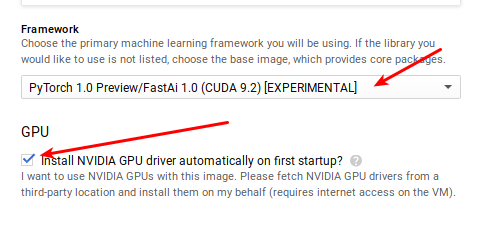
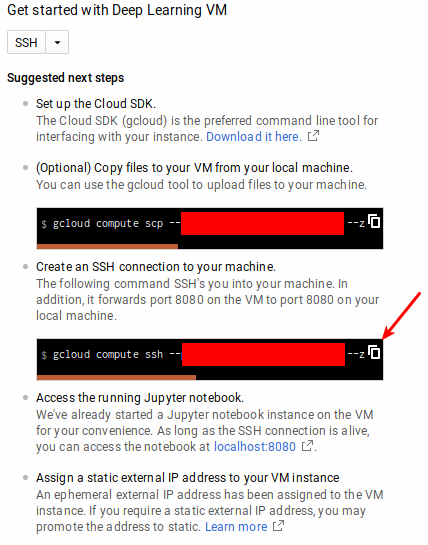
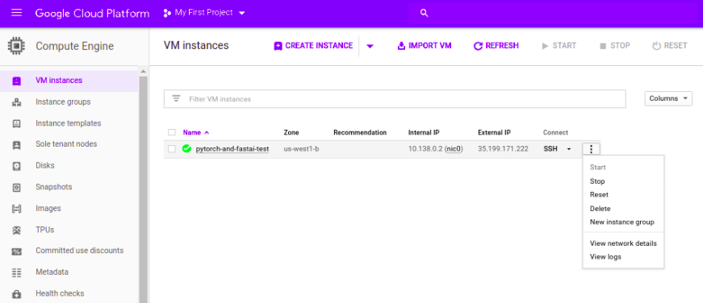

---

title: GCP
sidebar: home_sidebar


---

# Welcome to GCP!

This guide explains how to set up Google Cloud Platform (GCP) to use PyTorch 1.0.0 and fastai 1.0.2. At the end of this tutorial you will be able to use both in a GPU-enabled Jupyter Notebook environment.

## Pricing

A `n1-highmem-2` instance in Google which is what we suggest is $0.1184 per hour. Attaching a Tesla k80 GPU costs $0.45 per hour so both together amount to [$0.684 per hour](https://cloud.google.com/compute/pricing).

## Step 1: Creating your account

Cloud computing allows users access to virtual CPU or GPU resources on an hourly rate, depending on the hardware configuration. Find more information in the [Google Cloud Platform documentation](https://cloud.google.com/compute/). In case you don't have a GCP account yet, you can create one [here](https://cloud.google.com/),  which comes with $300 worth of usage credits for free. 

>  **Potential roadblock**: Even though GCP provides a $300 initial credit, you must enable billing to use it. For a new bank account it will take several days for the activation. 

The project on which you are going to run the image needs to be linked with your billing account. For this navigate to the [billing dashboard](https://console.cloud.google.com/billing/projects), click the '**...**' menu and choose '**change billing account**'.

## Step 2: Start an instance
First, go to the [marketplace page](https://console.cloud.google.com/marketplace/details/click-to-deploy-images/deeplearning) of Deep Learning images and click 'launch on compute engine'. Wait a couple of minutes for the next page to load, then, select a project. If you want/need to add a new one you can do that with the '+' button on the top right. Finally, select 'Pytorch 1.0 Preview/FastAi 1.0' in the 'Frameworks' section, check 'Install NVIDIA GPU driver automatically on first startup?' and click 'Deploy'. For now leave all other fields to their default values, as soon as you are getting more profecient using GCP you can read the GCP documentation for all details. 



Leave open the tab that is opened after your instance is deployed since we will need to copy some information from it on the next step.  

## Step 3: Connect to your instance

To be able to connect to your instance, you'll need to install Google Cloud's command line interface (CLI) software from Google. For Windows user, we recommend that you use the [Ubuntu terminal](terminal_tutorial) and follow the same instructions as Ubuntu users. 

To install, follow the instructions [here](https://cloud.google.com/sdk/docs/quickstart-macos) for MacOS (points 1 to 4 then come back) and [there](https://cloud.google.com/sdk/docs/quickstart-debian-ubuntu) for Linux or Windows (the four instructions in the gray box).

In both cases, once the installation is done run this line
```
gcloud init
```
You will first need to login to your google account then paste a confirmation code. Then you will be prompted for your project (pick the number that matches) and ask if you want to put a default region (choose the same as your instance to make your life easier later).

Once this is done, you can connect to your instance by typing:
```
gcloud compute ssh jupyter@{instance_name} -- -L 8080:localhost:8080
```

If your instance isn't in the same zone as what you set up, you'll have to specify it like this:
```
gcloud compute ssh --zone {zone_name} jupyter@{instance_name} -- -L 8080:localhost:8080
```

In any case, you can see the command you need to run under 'Create an ssh connection yo your machine' in the page with the deployment report. Just note that you need to add 'jupyter@' before your instance name to get admin rights on your instance.



Before you are able to connect, Google Cloud may ask you to create an SSH key. Just follow the prompts, choose a passphrase and save it somewhere safe.

If everything went ok, you should now be connected to your GCP instance! Cicking the link in your deploy page under 'Access the running Jupyter notebook' will open a new window with jupyter lab. To switch to jupyter notebook replace 'lab' by 'tree' or go at [localhost:8080/tree](http://localhost:8080/tree). Note that this only work while you maintain the ssh connection. 

## Step 4: Access fast.ai materials

Run `git clone https://github.com/fastai/course-v3` in your terminal to get a folder with all the fast.ai materials. 

Next move into the directory where you will find the materials for the course by running:

`cd course-v3/nbs`

Finally run `jupyter notebook` in your terminal, as seen above. Voilà! Now you can experiment yourself with fast.ai lessons! If it is your first time with Jupyter Notebook, refer to our [Jupyter Notebook tutorial](http://course-v3.fast.ai/dlami_tutorial.html).

If you have any problem while using the `fastai` library try running `conda update -all`.

## Step 5: Stop an instance


You will be charged if you don't stop the instance while it's 'idle' (e.g. not training a network). To stop an instance out of Google Cloud's online interface go [here](https://console.cloud.google.com/compute/instances), click the '...' icon to the right of the instance and choose 'Stop'.




## References

+ [Setting up PyTorch and Fast.ai in GCP](https://blog.kovalevskyi.com/google-compute-engine-now-has-images-with-pytorch-1-0-0-and-fastai-1-0-2-57c49efd74bb)
+ [Launching a PyTorch Deep Learning VM Instance](https://cloud.google.com/deep-learning-vm/docs/pytorch_start_instance)
+ [Google Cloud SDK Quickstart for Debian and Ubuntu](https://cloud.google.com/sdk/docs/quickstart-debian-ubuntu)
+ [Installing the latest Cloud SDK version](https://cloud.google.com/sdk/docs/#install_the_latest_cloud_tools_version_cloudsdk_current_version)
+ [Installing Google Cloud SDK (StackOverflow question)](https://stackoverflow.com/questions/46822766/sudo-apt-get-update-sudo-apt-get-install-google-cloud-sdk-cannot-be-done)
+ [sudo apt-get update && sudo apt-get install google-cloud-sdk cannot be done (StackOverflow answer)](https://stackoverflow.com/a/47908542/45963)

---

*Many thanks to Marcel Ackermann, Antonio Rueda Toicen, Viacheslav Kovalevskyi and Francisco Ingham for their contributions to this guide.*
