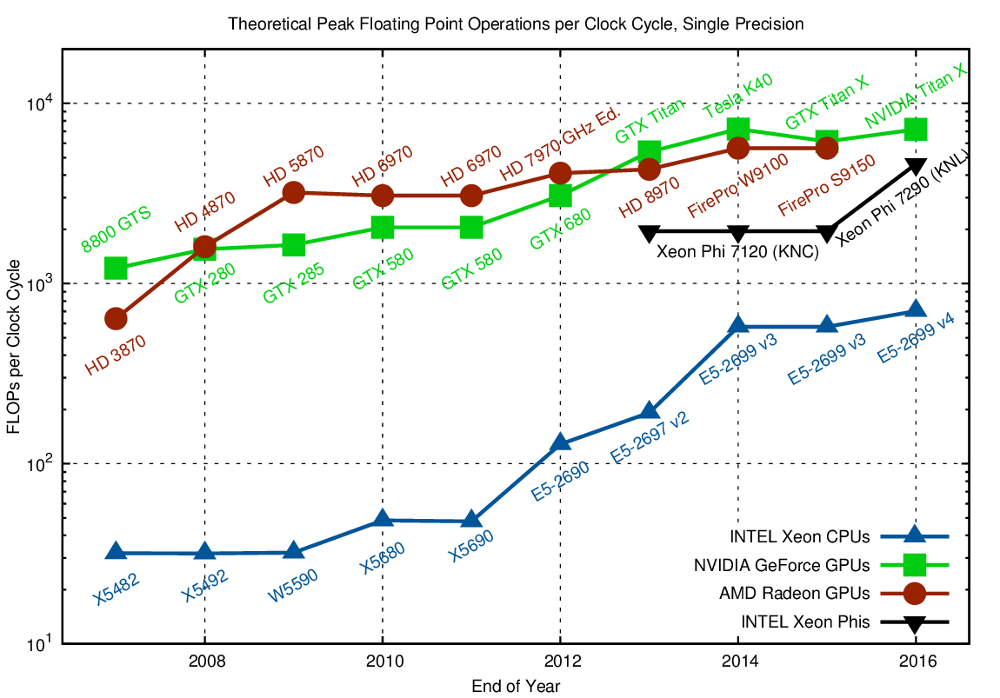

---

title: GPU
sidebar: home_sidebar

---
## What is a GPU?

GPUs are specialized hardware originally created to render games in high frame rates. Graphics texturing and shading require highly parallel matrix and vector operations. 

## Why a GPU?

It so happens that Deep Learning also requires super fast matrix computations. So researchers put two and two together and [started training models in GPU's](http://www.machinelearning.org/archive/icml2009/papers/218.pdf) and the rest is history.

| GPU                     |            CPU            |
| ----------------------- | :-----------------------: |
| Optimized FP Operations |  Complex Instruction Set  |
| Slow (1-2 Ghz)          |      Fast (3-4 Ghz)       |
| > 1000 Cores            |        < 100 Cores        |
| Fast Dedicated VRAM     | Large Capacity System RAM |

Deep Learning really only cares about the number of Floating Point Operations (FLOPs) per second. GPUs are highly optimized for that. 

In the chart above, you can see that GPUs (red/green) can theoretically do 10-15x the operations of CPUs (in blue).  This speedup very much applies in practice too. **But do not take our word for it!**  

Try running this inside a Jupyter Notebook:

Cell [1]:  
`import torch`  
`t_cpu = torch.rand(500,500,500)`  
`%timeit t_cpu @ t_cpu`  

Cell [2]:  
`t_gpu = torch.rand(500,500,500).cuda()`  
`%timeit t_gpu @ t_gpu`  

If you would like to train anything meaningful in deep learning, a GPU is what you need - specifically an NVIDIA GPU.

 

## Why NVIDIA?

We recommend you to use an NVIDIA GPU since they are currently the best out there for a few reasons:

1. Currently the fastest

2. Native Pytorch support for CUDA

3. Highly optimized for deep learning with cuDNN

## How to get access to an NVIDIA GPU?

You have 3 options to choose from:
1.  Connect to a GPU-enabled Jupyter Notebook platform:
    * [Sagemaker](course-v3.fast.ai/sagemaker_tutorial.html)
    * [Gradient](course-v3.fast.ai/gradient_tutorial.html)
    * [Salamander](course-v3.fast.ai/salamander_tutorial.html)
2. Cloud Server with access to GPU 
    * [DLAMIIt does look good!](course-v3.fast.ai/dlami_tutorial.html)
    * [GCP](course-v3.fast.ai/gcp_tutorial.html)
    * [Paperspace](course-v3.fast.ai/paperspace_tutorial.html)
3. Personal Computer with GPU hardware installed

**For those starting out, we highly recommend a Jupyter Notebooks platform (Option 1)**

* Notebooks are the easiest way to start writing python code and experimenting with deep learning.  
* Renting a Cloud Server (Option 2) requires environment configuration and setup.  
* Building a PC (Option 3) requires environment setup and more up-front money. Obviously a moot point if you already own a gaming PC.  

For [Part 2](http://course.fast.ai/part2.html) of the course, we will go into more specific details and benefits on both building a PC and renting a server.

---

*Many thanks to Andrew Shaw for writing this guide.*