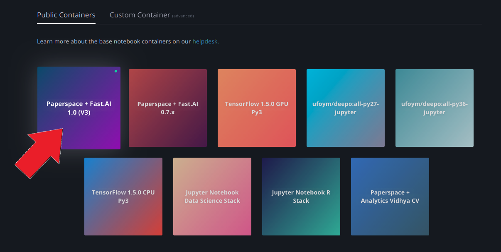
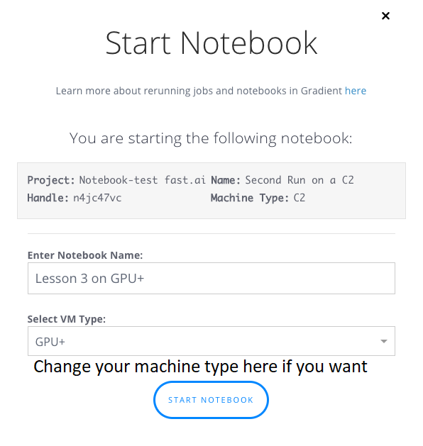

# Fast.ai Deep Learning Course v3 on Gradient° Notebooks

### Run the Fast.ai Notebook in the cloud in less than 2 minutes 🚀

This is a quick guide to starting v3 of the Fast.ai course. With [Gradient](https://www.paperspace.com/gradient), you get quick access to a Jupyter Lab Notebook instance without complicated installs or configuration.

[Gradient](https://www.paperspace.com/gradient) is built on top of [Paperspace](https://www.paperspace.com/) is a GPU-accelerated cloud platform. 

##### Summary of Charges
There are no storage fees associated with Gradient. Notebooks are billed while they're running (per second!) and the rate is dependent on the [Instance Type](https://support.paperspace.com/hc/en-us/articles/360007742114-Gradient-Instance-Types) selected.  Notebooks must be stopped to end billing. See below for free GPU credit! 💰

## Step 1: Create an account
To get started, create an account [here](https://www.paperspace.com/account/signup) and confirm your account by clicking the verification link in your inbox.

## Step 2: Create Notebook
1. Login and select Gradient > Notebooks.

2. Select the *Fast.ai 1.0 / PyTorch 1.0 BETA* base container.

3. Select the type of machine you want to run on.

4. Name your Notebook (optional)

5. Enter your payment details (if you're new to Paperspace). *Even if you have a promo or referral code, all active Paperspace accounts must have a valid credit card on file. You'll be able to enter your promo code later.*

6. Click Create Notebook

Your Notebook will go from Pending to Running, and will be ready to use :star2:.

When you click Create Notebook, that will start your Notebook and your billing for utilization will begin. To stop billing, you must stop your Notebook. Notebooks will automatically shut down after 12 hours.

## Step 3: Start learning Fast.ai!
You should now have a running fast.ai notebook. It might take a few minutes to provision, but once it's running you just have to click "open" to open up a Jupyter notebook

## Step 4: Stopping your Notebook
Just click stop.  This will end the billing session.

NOTE: you *will* be charged for the time that your notebook is running. You must stop the notebook to stop incurring charges.

---

## Additional considerations:

### Restarting your Notebook
Click Start to pick up where you left off, and/or choose a different VM type on which you'd like to run your Notebook. This can be extremely useful when you want to start on a lower-end machine type and then move to a more powerful GPU. Also, sometimes the GPU type that you started the notebook on will be unavailable, in which case you can easily fire it up on a different GPU.

### Managing Data
The `/storage` folder is your [Persistent Storage](https://support.paperspace.com/hc/en-us/articles/360001468133-Persistent-Storage). Files placed here are available across all Notebooks, Jobs, and Linux machines. This repository is perfect for storing training datasets. Note: Persistent Storage is region specific (you'll see the storage region options when creating Notebooks and Jobs).

### Promotional credit
Paperspace provides $10 of free Gradient° credit. This code is to be used for Fast.ai students only. In your console, click on Billing and enter the promo code at the bottom right. The promo code for this course is: **FASTAIGR45T**.

Note: If you opt for a Gradient 1 Subscription, promotional credit does not apply. [Learn more about Gradient Subscription levels here](https://support.paperspace.com/hc/en-us/articles/360002068913-Gradient-Subscriptions).

### Where to get help

Questions or issues related to course content, we recommend posting in the [fast.ai forum](http://forums.fast.ai/).

For Paperspace-specific support, check out the rest of the [Gradient Help Center](https://support.paperspace.com/hc/en-us/categories/115000426054-Gradient-) or submit a support ticket with [this form](https://support.paperspace.com/hc/en-us/requests/new).
