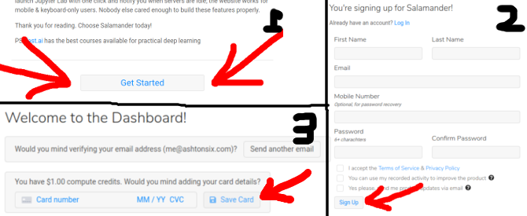
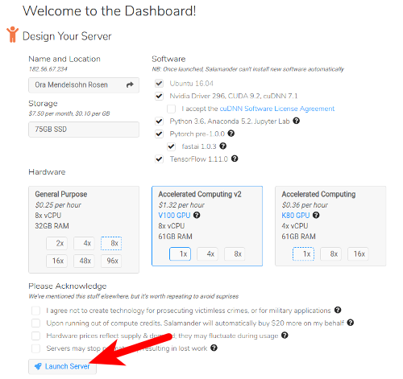

---

title: Salamander
sidebar: home_sidebar

---

# Welcome to Salamander!

It takes about 1 minute to signup & launch a Salamander server. The servers include everything you need to complete the fastai v3 course. Once launched, you can jump straight to Jupyter Lab or connect directly via ssh.

## Pricing

Salamander tracks the AWS _spot_ price +26%. Prices at time of writing:

- K80: $0.36 per hour
- V100: $1.32 per hour

## Step 1: Create an account

Visit [https://salamander.ai](https://salamander.ai), click "Get Started", fill-in the form & add your card details.

## Step 2: Create your server

> If you already have a Salamander account, we recommend creating a brand new server to get the latest version of fastai

Pick your desired hardware & storage size (if you don't know what to choose, just keep the default options). Click "Launch Server" & wait about a minute for the server to start.

## Step 3: Connect to your Server

#### via Terminal

Click "Setup Access Key" and generate or upload an ssh key - it'll get added to all of your servers automatically. You can then copy & paste `ssh ubuntu@[xxx.xxx.xxx.xxx]` from the webpage to your terminal. Press enter & you're in! Note that if you choose to have Salamander generate a key for you, you shouldn't use it for any other servers.

#### Jupyter Notebook

By default Salamander uses *Jupyter Lab* instead of *Jupyter Notebook*. Either works for the course, however since Jeremy uses and recommends Notebook, you might prefer to use it to. To switch to Jupyter Notebook, open "Preferences and Account Details" & click "Switch to Jupyter Notebook". Then click on *notebook_tutorial.ipynb* to learn how to use the notebook interface.

After opening a notebook select the "fastai" kernel.

When you're all done, **don't forget to shut down your instance**, so you don't get charged for all the time it's running in the background. It's not enough to just close your browser or turn off your own computer.

