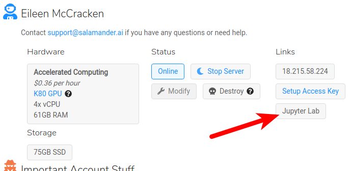
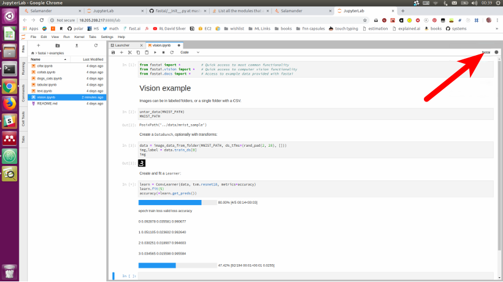

---

title: Salamander
sidebar: home_sidebar

---

# Welcome to Salamander!

It takes about 1 minute to signup & launch a Salamander server. The servers include everything you need to complete the fastai v3 course. Once launched, you can jump straight to Jupyter Lab or connect directly via ssh.

## Pricing

Salamander tracks the AWS _spot_ price +26%. Prices at time of writing:

- K80: $0.36 per hour
- V100: $1.32 per hour

#### AWS Credits

If you have an AWS promo code you can redeem 75% of it's value for Salamander credits. Signup, email [support@salamander.ai](mailto:support@salamander.ai) with the subject "AWS CREDITS" & include your promo code in the email body. It will take up to 10 days for the credits to appear in your Salamander account.

## Step 1: Create an account

Visit https://salamander.ai, click "Get Started", fill-in the form & add your card details.

## Step 2: Create your server

> If you already have a Salamander account, we recommend creating a brand new server to get the latest version of fastai

Pick your desired hardware & storage size (if you don't know what to choose, just keep the default options). Click "Launch Server". It'll take about a minute to start.

## Step 3: Connect to your Server

#### via Terminal

Click "Setup Access Key" and generate or upload an ssh key - it'll get added to all of your servers automatically. You can then copy & paste `ssh ubuntu@[xxx.xxx.xxx.xxx]` from the webpage to your terminal. Press enter & you're in!

#### Jupyter Lab via Web

Just click "Jupyter Lab" - that's it.

You can switch to Jupyter Notebook if you prefer the old interface - open "Preferences and Account Details" & click "Switch to Jupyter Notebook". If you're unfamiliar with Jupyter Notebook please refer to our [Jupyter Notebook tutorial](http://course-v3.fast.ai/notebook_tutorial.html).

After opening a notebook select the "fastai" kernel ("fastai-0.7" for v2 course).

