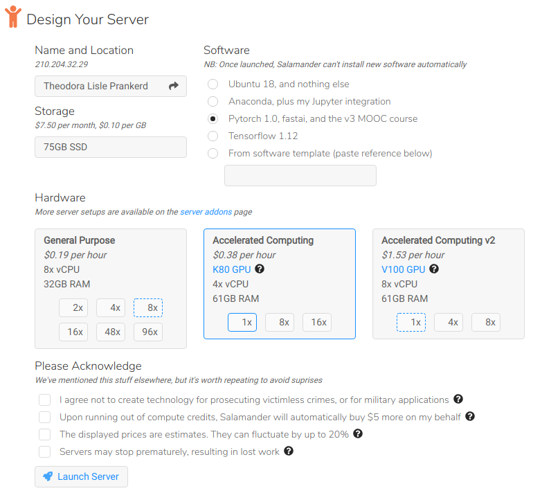

# Get started with Salamander!

> includes fastai 1.0, pytorch 1.0 & v2 / v3 course material
>
> K80 = $0.36 per hour, V100 = $1.29 per hour

#### Create an account

1. Go to https://salamander.ai
2. Click "Get Started"
3. Enter your email & password; click "Sign Up"
4. Add your card details

#### Create your server

1. Accept the CuDNN license & acknowledgements
2. Pick your software, hardware & storage size (the defaults work fine btw)
3. Click "Launch Server"

#### Access Jupyter Lab

You can access course materials & do science inside Jupyter Lab.

1. Wait for the server to start (just 1 minute)
2. Click "Jupyter Lab"
3. Navigate to "~/fastai-courses/course-v3", "~/fastai-courses/course-v2" or "~/fastai/examples"
4. Open a notebook, & select the "fastai" kernel ("fastai-0.7" for v2 course)
5. Go nuts

#### Connect to your server

1. Click "Setup Access Key"
2. Generate or upload a key
3. The key will be added to all of your servers
4. Copy & paste `ssh ubuntu@[xxx.xxx.xxx.xxx]` into your terminal

#### Stop your server

* Remember to stop your server when you are not using it!
* Once stopped, you can replace your server's hardware and / or increase the storage size by clicking "Modify"

#### How charges work

* You only pay for hardware when your server is turned on
* Our compute charge tracks the AWS spot price (+26%, and we pick the best availability zones to improve uptime / cost)
* You keep paying for storage until you destroy a server
