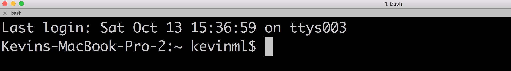
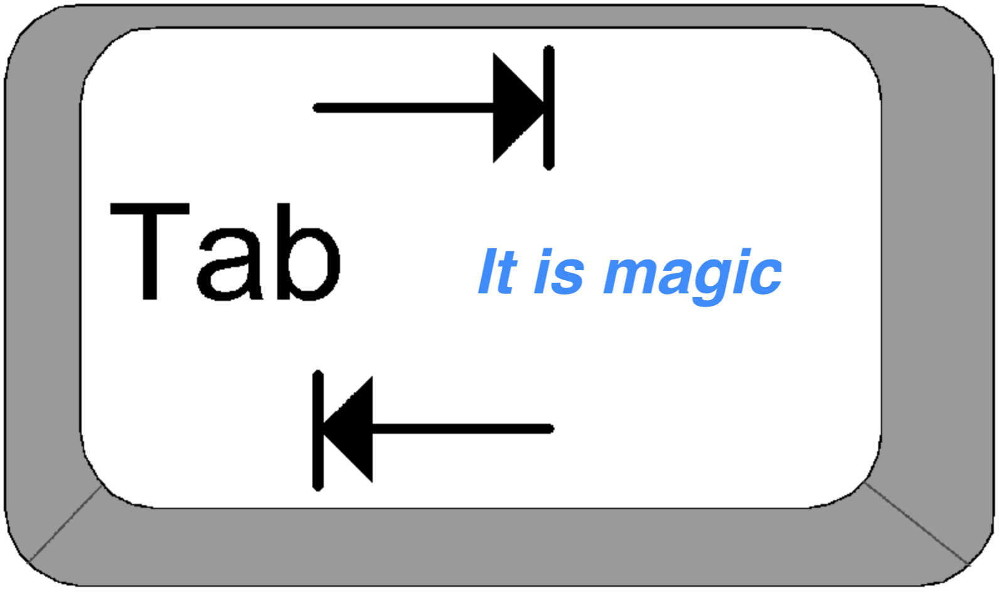
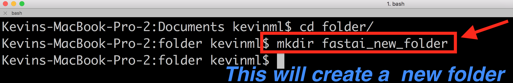
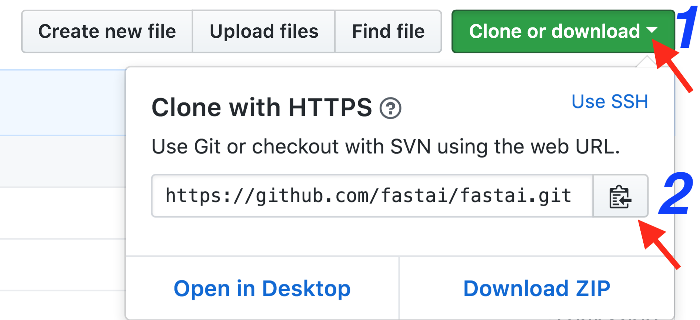
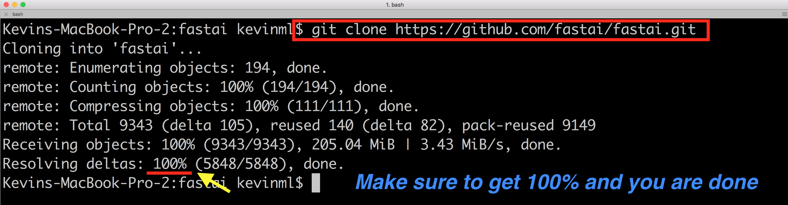

---

title: Terminal
keywords: 
sidebar: home_sidebar

---
## General explanation of the terminal

#### What is a terminal? 
It’s a black screen that allows you to interact directly with your computer with some lines of code.

### Navigating between folders

#### How to navigate into folders?
Write in the terminal “cd” and the name of the folder you want to access.

#### How to navigate out of folder?
Write in the terminal “cd ..”

### Important tips

In order to move faster and avoid typo errors while navigating between folders, you should use tab. You just need to start to type the file or directory name and once you wrote enough for it to be identified, you can press Tab.

If there is only one folder or file that starts with the characters you wrote, the name will autocompleted. If there are many that start that way, you can press double Tab to list them; in order words, it is like using the command "ls" 

### How to create a folder?
Write in the terminal "mkdir” and add the name of the folder.

### How to know where I am?
By writing “pwd”, the terminal will tell you where you are; in other words, the file directory you are working on.

### How to display files?
Write in the terminal “ls” and the terminal will list your files 

### How to copy a folder?
Write in the terminal “cp” with the file you want to copy and add the final destination folder where you want to paste it.

## Git and conda in terminal

### Cloning fastai repository (Download tha fastai files)

Go to this url: https://github.com/fastai/fastai , and copy the git url. It is so easy, click on the number 1 and 2 to have it on your clipboard.

Then, in order to clone the fastai repo, use the friendly command "git clone” and 
then paste the url in the clipboard by pressing <kbd>CTRL</kbd>+<kbd>V</kbd>

### Updating your fastai repository (Downloading the missing files)

When your repo is up-to-date, you should see this message.

If there are new missing files, you wil see this.

### Updating Conda 

On more thing, if you want to update conda, you should write this in the terminal "conda update conda" and you are done.

