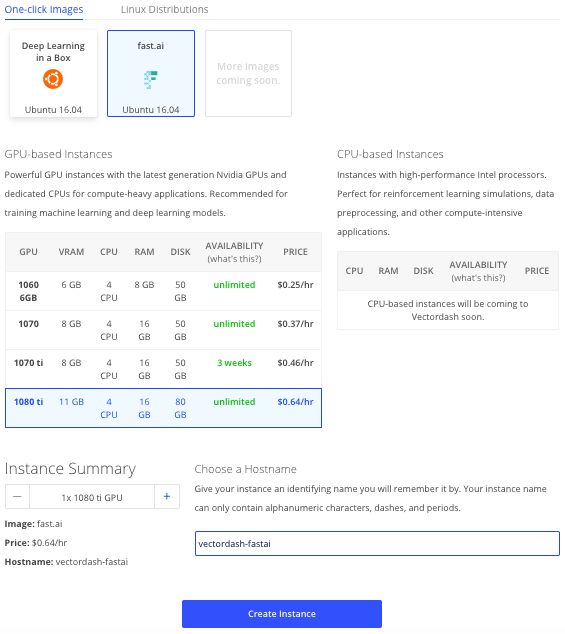
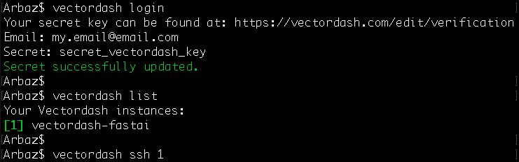
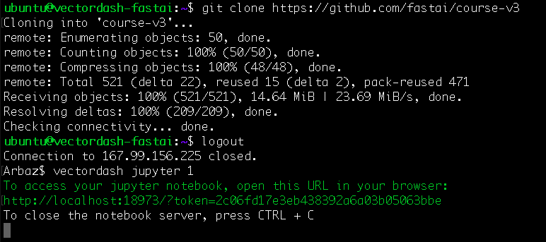

---

title: Vectordash
sidebar: home_sidebar

---

# Welcome to Vectordash!
This guide explains how to set up Vectordash to use PyTorch 1.0.0 and fastai 1.0.6. At the end of this
tutorial you will be able to use both in a GPU-enabled Jupyter Notebook environment.

## Pricing
The current cheapest Vectordash instance comes along with an Nvidia 1060 6GB GPU and costs $0.25 per
hour. You can try the more powerful GPU instances for
a few more cents per hour.

## Step 1: Creating your account
Vectordash offers cloud computing to fast.ai students. Cloud computing allows users access to virtual CPU or GPU resources on an hourly rate, depending on
the instance type. In case you do not already have an account on Vectordash, here is how to you can set
it up in less than 5 minutes:

1. Go to the [register page](http://vectordash.com/register).
2. Enter a valid email address and password.
3. Verify your email address with the confirmation link sent to your email.
4. Add a valid payment method (credit/debit card) to your account [here](http://vectordash.com/edit/payments).

Congrats! Your account is now setup.

## Step 2: Start an instance
1. Go to the [create page](http://vectordash.com/create) to start an instance.
2. Under One-click Images, select the fast.ai image
3. Select the GPU type you want. *Please note the prices that correspond to each type.*
4. Enter a hostname
5. Click 'Create Instance'

You will be redirected to the instance page. Leave it open since you will need some of the
information to setup the vectordash command line interface (CLI) in the next step.

## Step 3: Connect to your instance
We highly recommend using the vectordash-cli to interact with your Vectordash instance. With the
vectordash-cli, you can ssh into your instance, push/pull files, start a jupyter notebook with
one simple command, and more. To install and set it up, follow these steps:
1. Install pip:
    * MacOS/OS X: `sudo easy-install pip`
    * Linux: `sudo apt install python-pip`
2. `pip install vectordash -U`
3. `vectordash login`
    * Email: Vectordash account email
    * Secret: Vectordash secret token (can be found [here](http://vectordash.com/edit/verification))
4. `vectordash list`
5. `vectordash ssh $INSTANCE_ID`

## Step 4: Access fast.ai materials
After you have SSH-ed into to your instance, simply run the following command to access the
fast.ai materials:

`git clone https://github.com/fastai/course-v3`

If you would like to start a jupyter notebook on your instance, simply run the following command
on your local terminal:

`vectordash jupyter $INSTANCE_ID`

If you have any problem while using the fastai library try running `conda update -all`. If you want
to read the vectordash-cli documentation, you can find it [here](http://vectordash.com/docs/cli).

## Step 5: Stop an instance
You will be charged if you don't stop the instance while it's 'idle' (e.g. not training a network).
To stop an instance on Vectordash, go to the [dashboard](http://vectordash.com/dashboard) and click the
instance you would like to stop. Once on the instance page, click 'Stop Instance'. *Please note, stopping
an instance destroys it completely so make sure you save your files locally or in a remote storage location.*

## About Vectordash:

Vectordash is unlike other cloud providers in that we do not own datacenters, but rather we partner with
existing datacenters with have unused GPU capacity. Not owning any datacenters allows Vectordash to focus
on providing machine learning practitioners with the fastest and most affordable cloud GPU instances,
while also costing an order of magnitude less than other cloud providers such as AWS, Google Cloud, and
Azure. However due to our unique architecture, there are tradeoffs worth mentioning. Vectordash cannot
provide an uptime SLA guarantee or a security guarantee. We take steps to increase privacy such as
encrypting your data in transit and at rest, and thoroughly vetting datacenters for reliability and
security before letting them become a partner. And in the case an error does occur while using
Vectordash, we will refund you entirely.